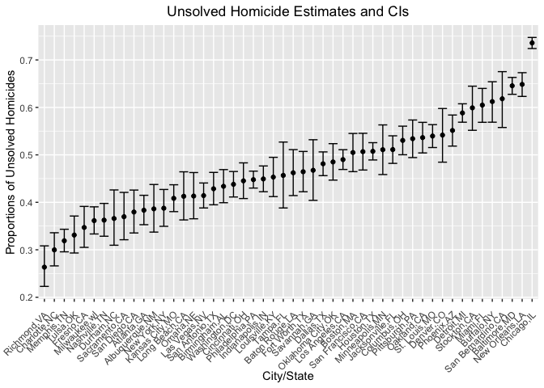

p8105_hw5_fy2297
================

``` r
# load libraries
library(tidyverse)
```

    ## ── Attaching packages ─────────────────────────────────────── tidyverse 1.3.2 ──
    ## ✔ ggplot2 3.3.6      ✔ purrr   0.3.5 
    ## ✔ tibble  3.1.8      ✔ dplyr   1.0.10
    ## ✔ tidyr   1.2.1      ✔ stringr 1.4.1 
    ## ✔ readr   2.1.2      ✔ forcats 0.5.2 
    ## ── Conflicts ────────────────────────────────────────── tidyverse_conflicts() ──
    ## ✖ dplyr::filter() masks stats::filter()
    ## ✖ dplyr::lag()    masks stats::lag()

``` r
library(rvest)
```

    ## 
    ## 载入程辑包：'rvest'
    ## 
    ## The following object is masked from 'package:readr':
    ## 
    ##     guess_encoding

``` r
library(httr)
library(purrr)
```

# Problem 1

# Problem 2

``` r
# import data
url = "https://raw.githubusercontent.com/washingtonpost/data-homicides/master/homicide-data.csv"
homicide_df = read_csv(url) %>% 
  janitor::clean_names()
```

    ## Rows: 52179 Columns: 12
    ## ── Column specification ────────────────────────────────────────────────────────
    ## Delimiter: ","
    ## chr (9): uid, victim_last, victim_first, victim_race, victim_age, victim_sex...
    ## dbl (3): reported_date, lat, lon
    ## 
    ## ℹ Use `spec()` to retrieve the full column specification for this data.
    ## ℹ Specify the column types or set `show_col_types = FALSE` to quiet this message.

raw data description: The raw dataset has 12 variables and 52179
observations. The main variables are reported date, victim race, sex,
age and its corresponding city and state.

``` r
# data manipulation
homicide_df = 
  homicide_df %>% 
  mutate(
    city_state = paste(city, state, sep = ","),
    disposition = ifelse(disposition == "Closed by arrest", "resolved", "unresolved")
  )
# create a new dataset and find the total number of homicides and the number of unsolved homicides within cities
homicide_summary_df =
  homicide_df %>% 
  group_by(city_state) %>% 
  summarize(
    total_homicides = n(),
    unsolved_homicides = sum(disposition == "unresolved")
  )
```

``` r
# About Baltimore, MD
Baltimore_df =  
  homicide_summary_df %>% 
  filter(city_state == "Baltimore,MD")

test_stats_Baltimore = 
prop.test(
  Baltimore_df$unsolved_homicides,Baltimore_df$total_homicides) %>% 
  broom::tidy()
```

The estimated proportion of unsolved homicides in Baltimore,MD is about
64.6% and the confidence interval is \[62.8%, 66.3%\].

``` r
# find statistics for all cities
test_stats_all = 
  homicide_summary_df %>% 
  mutate(
    test_stats = map2(unsolved_homicides, total_homicides, ~prop.test(.x, .y)),
    test_stats = map(test_stats, broom::tidy)
  ) %>% 
  unnest() %>% 
  arrange(estimate) %>% 
  select(
    city_state, estimate, conf.low, conf.high
  )
```

    ## Warning in prop.test(.x, .y): Chi-squared近似算法有可能不准

    ## Warning: `cols` is now required when using unnest().
    ## Please use `cols = c(test_stats)`

``` r
# create a plot that shows the estimates and CIs for each city
test_stats_all %>% 
  filter(city_state != "Tulsa,AL") %>% 
  mutate(city_state = fct_reorder(city_state, estimate)) %>% 
  ggplot(aes(x = city_state, y = estimate)) + geom_point() + geom_errorbar(aes(ymin = conf.low, ymax = conf.high)) +
  labs(title = "Unsolved Homicide Estimates and CIs",x = "City/State", y = "Proportions of Unsolved Homicides") +
  theme(axis.text.x = element_text(angle = 45, vjust = 0.9, hjust = 1)) +
  theme(plot.title = element_text(hjust = 0.5)) 
```

<!-- -->

# Problem 3
