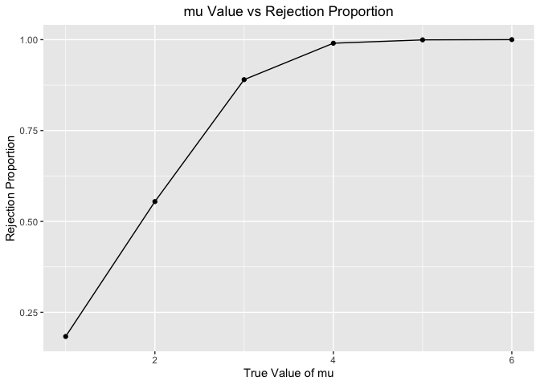

p8105_hw5_fy2297
================

``` r
# load libraries
library(tidyverse)
```

    ## ── Attaching packages ─────────────────────────────────────── tidyverse 1.3.2 ──
    ## ✔ ggplot2 3.3.6      ✔ purrr   0.3.5 
    ## ✔ tibble  3.1.8      ✔ dplyr   1.0.10
    ## ✔ tidyr   1.2.1      ✔ stringr 1.4.1 
    ## ✔ readr   2.1.2      ✔ forcats 0.5.2 
    ## ── Conflicts ────────────────────────────────────────── tidyverse_conflicts() ──
    ## ✖ dplyr::filter() masks stats::filter()
    ## ✖ dplyr::lag()    masks stats::lag()

``` r
library(rvest)
```

    ## 
    ## 载入程辑包：'rvest'
    ## 
    ## The following object is masked from 'package:readr':
    ## 
    ##     guess_encoding

``` r
library(httr)
library(purrr)
library(patchwork)
```

# Problem 1

# Problem 2

``` r
# import data
url = "https://raw.githubusercontent.com/washingtonpost/data-homicides/master/homicide-data.csv"
homicide_df = read_csv(url) %>% 
  janitor::clean_names()
```

    ## Rows: 52179 Columns: 12
    ## ── Column specification ────────────────────────────────────────────────────────
    ## Delimiter: ","
    ## chr (9): uid, victim_last, victim_first, victim_race, victim_age, victim_sex...
    ## dbl (3): reported_date, lat, lon
    ## 
    ## ℹ Use `spec()` to retrieve the full column specification for this data.
    ## ℹ Specify the column types or set `show_col_types = FALSE` to quiet this message.

raw data description: The raw dataset has 12 variables and 52179
observations. The main variables are reported date, victim race, sex,
age and its corresponding city and state.

``` r
# data manipulation
homicide_df = 
  homicide_df %>% 
  mutate(
    city_state = paste(city, state, sep = ","),
    disposition = ifelse(disposition == "Closed by arrest", "resolved", "unresolved")
  )
# create a new dataset and find the total number of homicides and the number of unsolved homicides within cities
homicide_summary_df =
  homicide_df %>% 
  group_by(city_state) %>% 
  summarize(
    total_homicides = n(),
    unsolved_homicides = sum(disposition == "unresolved")
  )
```

``` r
# About Baltimore, MD
Baltimore_df =  
  homicide_summary_df %>% 
  filter(city_state == "Baltimore,MD")

test_stats_Baltimore = 
prop.test(
  Baltimore_df$unsolved_homicides,Baltimore_df$total_homicides) %>% 
  broom::tidy()
```

The estimated proportion of unsolved homicides in Baltimore,MD is about
64.6% and the confidence interval is \[62.8%, 66.3%\].

``` r
# find statistics for all cities
test_stats_all = 
  homicide_summary_df %>% 
  mutate(
    test_stats = map2(unsolved_homicides, total_homicides, ~prop.test(.x, .y)),
    test_stats = map(test_stats, broom::tidy)
  ) %>% 
  unnest() %>% 
  arrange(estimate) %>% 
  select(
    city_state, estimate, conf.low, conf.high
  )
```

    ## Warning in prop.test(.x, .y): Chi-squared近似算法有可能不准

    ## Warning: `cols` is now required when using unnest().
    ## Please use `cols = c(test_stats)`

``` r
# create a plot that shows the estimates and CIs for each city
test_stats_all %>% 
  filter(city_state != "Tulsa,AL") %>% 
  mutate(city_state = fct_reorder(city_state, estimate)) %>% 
  ggplot(aes(x = city_state, y = estimate)) + geom_point() + geom_errorbar(aes(ymin = conf.low, ymax = conf.high)) +
  labs(title = "Unsolved Homicide Estimates and CIs",x = "City/State", y = "Proportions of Unsolved Homicides") +
  theme(axis.text.x = element_text(angle = 90, vjust = 0.9, hjust = 1)) +
  theme(plot.title = element_text(hjust = 0.5)) 
```

<!-- --> In
the previous part of the problem, Tulsa,AL was not removed from the
dataset of statistics because it didn’t influence anything. However,
when making the plot, it was filtered out of the dataset to make the
plot look more beautiful and tidy.

# Problem 3

``` r
# write a function
test_func = function(n = 30, mu, sigma = 5){
  sim_data = tibble(
    x = rnorm(n=n, mean = mu, sd = sigma)
  )
  sim_data %>% 
    summarize(
      t_test_stats = t.test(x, mu = 0, conf.level = 0.95)
     %>% 
    broom::tidy() %>% 
    select(estimate, p.value)
    )
}

# generate 5000 datasets from the model and save mu_hat and p-value
model_test =
  rerun(10, test_func(mu = 0)) %>% 
  bind_rows() %>% 
  mutate(
    mu_hat = t_test_stats$estimate,
    p_value = t_test_stats$p.value
    ) %>% 
  select(mu_hat, p_value)

model_test
```

    ## # A tibble: 10 × 2
    ##     mu_hat p_value
    ##      <dbl>   <dbl>
    ##  1  0.602   0.575 
    ##  2 -1.56    0.0638
    ##  3  0.129   0.887 
    ##  4 -0.410   0.682 
    ##  5  0.424   0.549 
    ##  6  1.56    0.0614
    ##  7 -0.0740  0.932 
    ##  8 -0.881   0.365 
    ##  9  0.0985  0.917 
    ## 10  0.846   0.420

``` r
# repeat for different mu
diff_mu_df = 
  tibble(mu_list = c(1:6)) %>% 
  mutate(output = map(.x = mu_list, ~rerun(10,test_func(mu = .x)))) %>% 
  bind_rows() %>% 
  unnest() %>% 
  unnest(cols = output) %>% 
  mutate(
    mu_hat = t_test_stats$estimate,
    p_value = t_test_stats$p.value
  ) %>% 
  select(mu_list, mu_hat, p_value)
```

    ## Warning: `cols` is now required when using unnest().
    ## Please use `cols = c(output)`

``` r
# make a plot
plot_1 =
  diff_mu_df %>% 
  group_by(mu_list) %>% 
  summarize(
    total_n = n(), reject_n = sum(p_value<0.05)
  ) %>% 
  mutate(
    reject_prop = reject_n / total_n
  ) %>% 
  ggplot(aes(x = mu_list, y = reject_prop)) + geom_point() + geom_line()+
  labs(title = "mu Value vs Rejection Proportion",x = "True Value of mu", y = "Rejection Proportion") +
  theme(plot.title = element_text(hjust = 0.5)) 

plot_1
```

<!-- -->
description: From the plot, there is a general increasing trend, which
means as the effect size increases, the power also increases.

``` r
# make other plots
plot_2 =
  diff_mu_df %>% 
  group_by(mu_list) %>% 
  summarize(
    ave_mu_hat = mean(mu_hat)
  ) %>% 
  ggplot(aes(x = mu_list, y = ave_mu_hat)) + geom_point() + geom_line()+
  labs(title = "True mu vs Average mu (all)",x = "True Value of mu", y = "Average Value of mu") +
  theme(plot.title = element_text(hjust = 0.5)) 
```

``` r
plot_3  = 
  diff_mu_df %>% 
  filter(p_value < 0.05) %>% 
  group_by(mu_list) %>% 
  summarize(
    ave_mu_hat = mean(mu_hat)
  ) %>% 
  ggplot(aes(x = mu_list, y = ave_mu_hat)) + geom_point() + geom_line()+
  labs(title = "True mu vs Average mu (rejected)",x = "True Value of mu", y = "Average Value of mu") +
  theme(plot.title = element_text(hjust = 0.5)) 
```

``` r
plot_2 + plot_3
```

<!-- -->
description: from the right plot (for only rejected ones), as true value
of mu increases, the average value of mu get closer to the true value,
but when effect size is small, there are some deviations between average
value and true value of mu because the power increases with the increase
in effect size.
